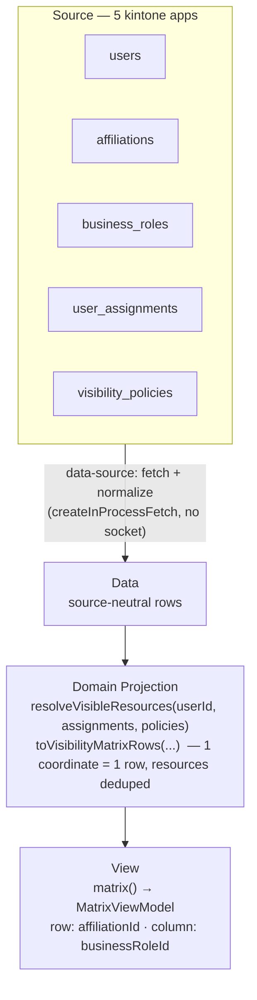
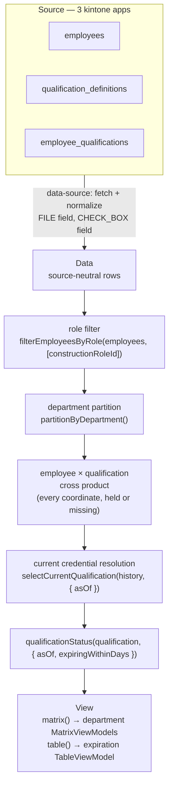

# source-data-view-examples

Runnable proof that

```text
Source → Data → Domain Projection → View
```

holds up for real business domains — not just for a `customers`/`orders` toy case, but for an access-policy matrix and an employee-qualification tracker, each with the kind of messy requirements (dedupe, missing-cell handling, current-record resolution, expiry rules) that usually push people to bolt business logic onto their UI or data layer.

**This is not a library.** It doesn't ship `npm install`-able code for anyone else's app. It's an example collection that stays runnable, so the architecture claim can be checked by running `pnpm test`, not just read.

The libraries under test:

- [`@f4ah6o/data-source`](https://github.com/f4ah6o/data-source) — Source → Data (multi-app fetch, per-app query, join, post-join query)
- [`@f4ah6o/data-view`](https://github.com/f4ah6o/data-view) — Data → View (`table`, `tree`, `matrix`, path-based adapters)
- [`kintone-mock-server`](https://github.com/f4ah6o/kintone-mock-server) — a socketless kintone mock (`createInProcessFetch`) used as the Source in every example here

## The pipeline, and why Domain Projection is its own stage

```text
Source            →   Data              →   Domain Projection   →   View
(kintone apps)        (rows + columns,      (pure business        (ViewModel)
                        source-neutral)       rules, per example)
```

`data-source` and `data-view` each have a narrow, deliberate job:

- `data-source` fetches, normalizes, and joins rows into a **source-neutral `Data`** shape. It knows what a join is; it has no idea what "eligible employee" or "current credential" means.
- `data-view` turns **arrays of items** into a `ViewModel` via generic axis functions (`table`, `matrix`, `tree`). It knows how to build a matrix from `row`/`column`/`value` functions; it has no idea what a "policy coordinate" or a "qualification status" is.

Between them sits **Domain Projection**: the actual business rules — role filtering by a stable ID, building the complete employee × qualification coordinate set so `missing` cells are explicit, resolving one "current" credential out of a messy history, deciding what counts as `expiring`. This logic is real, it's non-trivial, and it is **specific to one business domain** — none of it belongs in a library meant to serve every domain.

If this logic leaked into `data-source` or `data-view`, both examples in this repo would eventually fight over the same generic API (a `groupBy`, a `reduce` option on `matrix()`, a `presentation: "avatar"` hint) and the libraries would grow a feature per feature request instead of staying small. Keeping Domain Projection as its own layer, entirely inside each example, is what lets `data-source` and `data-view` stay unchanged while two meaningfully different domains both come out the other end as a clean `ViewModel`. Neither example added a single line to either library — see [Results](#results-no-generic-core-changes-were-needed) below.

Domain Projection code is ordinary, framework-free TypeScript: pure functions in, plain data out. No React, no DOM, no CLI — see [Examples are framework-free](#examples-are-framework-free).

## Example 1: Visibility — 所属 × 業務役割

"Who can see what" as a policy matrix, not an access log: a user's _affiliation × business role_ combination is what grants visibility into a set of resources.



- Source: [`examples/visibility/fixtures/visibility.ts`](examples/visibility/fixtures/visibility.ts)
- Domain Projection: [`examples/visibility/domain/`](examples/visibility/domain)
- Tests: [`examples/visibility/test/visibility.test.ts`](examples/visibility/test/visibility.test.ts) (15 tests)

Highlights of what the Domain Projection layer owns:

- **allow-only resolution** — `resolveVisibleResources()`: user → assignments → (affiliation × role) coordinates → matching policies → deduped `ResourceRef[]`. No policy for a coordinate means no access; there's no deny/priority model (out of scope, by design).
- **aggregation before the Matrix ever sees the data** — `toVisibilityMatrixRows()` collapses assignments + policies down to exactly one row per `(affiliationId, businessRoleId)` coordinate, because `matrix()` itself correctly _rejects_ duplicate coordinates rather than silently picking one.
- **stable-ID axes** — the Matrix is keyed by `affiliationId`/`businessRoleId`, never by display name (two affiliations can share a name; a rename must not change identity).

## Example 2: Employee Qualifications — アバター・資格保有 Matrix・期限管理

Three use cases sharing one Domain Projection pipeline: employee avatars, a construction-role qualification matrix (including who holds _nothing_, and qualifications _nobody_ holds), and an expiry table with deterministic date-boundary rules.



- Source: [`examples/employee-qualifications/fixtures/qualifications.ts`](examples/employee-qualifications/fixtures/qualifications.ts)
- Domain Projection: [`examples/employee-qualifications/domain/`](examples/employee-qualifications/domain)
- Tests: [`examples/employee-qualifications/test/qualifications.test.ts`](examples/employee-qualifications/test/qualifications.test.ts) (31 tests)

Highlights of what the Domain Projection layer owns:

- **avatar as a domain wrapper, not a `data-view` feature** — `QualificationDepartmentView.employees: { id, name, photo? }[]` carries row-header metadata _next to_ the Matrix, not inside a cell. `data-view` never learns what an "avatar" is; a renderer resolves `employeeId → { name, photo }` itself. Primary photo selection from a kintone FILE field (which can hold multiple attachments) is deterministic: the first file in field order.
- **role filtering by stable ID** — `filterEmployeesByRole(employees, targetRoleIds)` takes the target role ID(s) as a parameter; nothing in this codebase branches on the string "施工業務" (construction). Rename the role, the logic doesn't move.
- **the complete coordinate set, not just held records** — building `employees × qualifications` before consulting history is what keeps a qualification-less employee, and a qualification nobody holds, visible instead of silently absent.
- **current-credential resolution over calendar dates** — `selectCurrentQualification()` implements a fully deterministic 6-step rule (future-dated records excluded, prefer valid-as-of-`asOf`, then most recent `acquiredAt`, then `expiresAt`, then a stable-ID tie-break, with a fallback so an all-expired history still resolves to something classifiable). Date math (`dates.ts`) never touches `Date`/`Date.now()` — it's pure day-number arithmetic, so it can't drift by timezone.
- **expiry status as a pure function of an explicit `asOf`** — `qualificationStatus()` never reads the clock; every boundary (`expiresAt === asOf`, exactly-at-threshold, threshold + 1 day) is pinned by a test.

## Results: no generic core changes were needed

Both examples run entirely on the _existing_ public API of `data-source` and `data-view`:

| Used from `data-source`                                                                                                                                                 | Used from `data-view`                                                                                                 |
| ----------------------------------------------------------------------------------------------------------------------------------------------------------------------- | --------------------------------------------------------------------------------------------------------------------- |
| `createKintoneSource`, multi-app fetch, per-app `query`                                                                                                                 | `matrix()` (unmodified — including its duplicate-coordinate rejection)                                                |
| kintone record normalize (incl. SUBTABLE, FILE, CHECK_BOX)                                                                                                              | `table()`                                                                                                             |
| — no `join` was used in either example; the employee/policy/qualification correlations are many-to-many by ID, which belongs in Domain Projection, not a row-level join | `getPath()` (reads Domain Projection's un-joined, per-source-namespaced rows without a `select` just to flatten them) |

Neither `groupBy`/`collect`/aggregation, a `matrix()` `reduce` option, axis-label APIs, nor a `presentation: "avatar"` hint were added — every one of those was considered and rejected in favor of solving it once, locally, per example. See each example's domain source for the reasoning inline.

## Directory structure

```text
source-data-view-examples/
├── examples/
│   ├── visibility/
│   │   ├── fixtures/        kintone mock fixture (5 apps)
│   │   ├── domain/          Domain Projection: types, resolve, matrix, kintone adapter
│   │   └── test/            visibility.test.ts
│   └── employee-qualifications/
│       ├── fixtures/        kintone mock fixture (3 apps)
│       ├── domain/          Domain Projection: types, dates, status, credentials, roles, matrix, expiration, kintone adapter
│       └── test/            qualifications.test.ts
├── vendor/                  vendored tarballs of the 3 dependencies (see below)
├── package.json
├── tsconfig.json
├── .oxlintrc.json / .oxfmtrc.json
└── README.md
```

Each example is self-contained: its `fixtures/` define the kintone apps and records, its `domain/` holds every pure function (no example imports from another example), and its `test/` drives the whole Source → Data → Domain Projection → View pipeline against an in-process kintone mock.

## Examples are framework-free

Every example stops at a `ViewModel` (`MatrixViewModel`, `TableViewModel`). Nothing here imports React, Vue, a DOM, or a CLI renderer — this repo proves the _data_ pipeline, not a UI. A renderer is a separate, later concern the ViewModels are designed to hand off to cleanly (e.g. resolving `employeeId → { name, photo }` from `QualificationDepartmentView.employees` while iterating `view.rows`).

## Dependencies: why `file:` tarballs, not a registry version

`@f4ah6o/data-source`, `@f4ah6o/data-view`, and `kintone-mock-server` are prototype libraries and aren't published to a registry yet. Rather than depend on local sibling directories (which would only work on one machine) or check the library source into this repo (which would make this an accidental fourth copy of the libraries instead of an examples repo), each dependency is vendored here as a built package tarball under [`vendor/`](vendor) — exactly the artifact `npm publish` would produce, just installed via `file:` instead of a registry:

```json
"@f4ah6o/data-source": "file:./vendor/f4ah6o-data-source-0.1.0.tgz"
```

This is deliberately temporary. Once those libraries are published for real, swap each `file:` entry for a normal semver range (e.g. `"^0.1.0"`) and delete `vendor/` — nothing else in this repo needs to change.

## Running

```sh
corepack enable
pnpm install
pnpm test
```

## Development

```sh
pnpm format       # oxfmt
pnpm lint         # oxlint
pnpm typecheck    # tsc --noEmit
pnpm test         # node --test, both examples
pnpm check        # all of the above
```

## Tests

```sh
pnpm test
```

runs both example suites (46 tests total) via Node's built-in test runner with `--experimental-strip-types` — no build step, no HTTP server. Every kintone fetch in every test goes through `kintone-mock-server`'s `createInProcessFetch()`, so the whole pipeline runs socketlessly and is safe in CI / sandboxed environments.

## License

MIT
